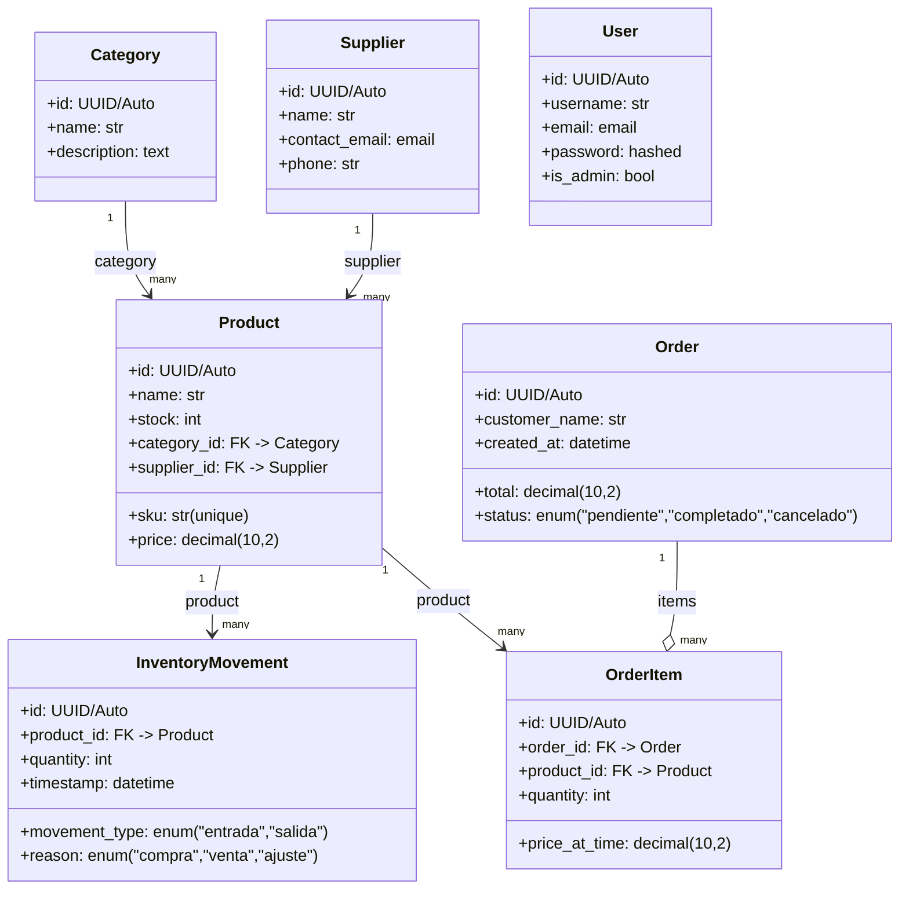

```mermaid
classDiagram
    class Category {
      +id: UUID/Auto
      +name: str
      +description: text
    }

    class Supplier {
      +id: UUID/Auto
      +name: str
      +contact_email: email
      +phone: str
    }

    class Product {
      +id: UUID/Auto
      +name: str
      +sku: str (unique)
      +price: decimal(10,2)
      +stock: int
      +category_id: FK -> Category
      +supplier_id: FK -> Supplier
    }

    class InventoryMovement {
      +id: UUID/Auto
      +product_id: FK -> Product
      +quantity: int
      +movement_type: enum("entrada","salida")
      +reason: enum("compra","venta","ajuste")
      +timestamp: datetime
    }

    class Order {
      +id: UUID/Auto
      +customer_name: str
      +total: decimal(10,2)
      +status: enum("pendiente","completado","cancelado")
      +created_at: datetime
    }

    class OrderItem {
      +id: UUID/Auto
      +order_id: FK -> Order
      +product_id: FK -> Product
      +quantity: int
      +price_at_time: decimal(10,2)
    }

    class User {
      +id: UUID/Auto
      +username: str
      +email: email
      +password: hashed
      +is_admin: bool
    }

    %% Relaciones
    Category "1" --> "many" Product : category
    Supplier "1" --> "many" Product : supplier
    Product  "1" --> "many" InventoryMovement : product
    Order    "1" --o "many" OrderItem : items
    Product  "1" --> "many" OrderItem : product
```