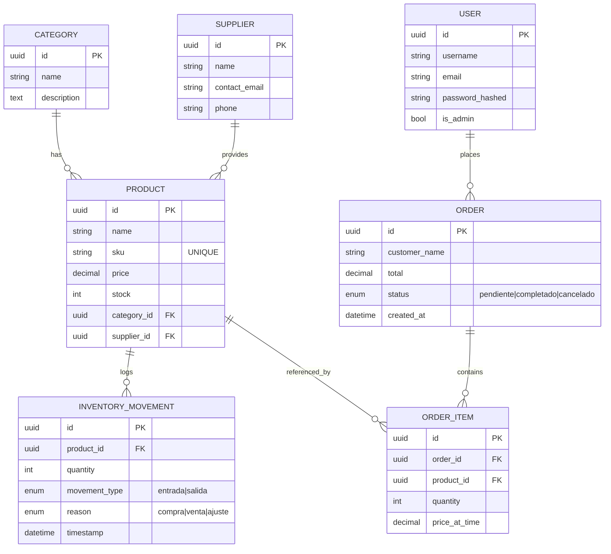

```mermaid
erDiagram
    CATEGORY ||--o{ PRODUCT : has
    SUPPLIER ||--o{ PRODUCT : provides
    PRODUCT  ||--o{ INVENTORY_MOVEMENT : logs
    "ORDER"  ||--o{ ORDER_ITEM : contains
    PRODUCT  ||--o{ ORDER_ITEM : referenced_by
    "USER"   ||--o{ "ORDER" : places

    CATEGORY {
        uuid id PK
        string name
        text description
    }
    SUPPLIER {
        uuid id PK
        string name
        string contact_email
        string phone
    }
    PRODUCT {
        uuid id PK
        string name
        string sku "UNIQUE"
        decimal price
        int stock
        uuid category_id FK
        uuid supplier_id FK
    }
    INVENTORY_MOVEMENT {
        uuid id PK
        uuid product_id FK
        int quantity
        enum movement_type "entrada|salida"
        enum reason "compra|venta|ajuste"
        datetime timestamp
    }
    "ORDER" {
        uuid id PK
        string customer_name
        decimal total
        enum status "pendiente|completado|cancelado"
        datetime created_at
    }
    ORDER_ITEM {
        uuid id PK
        uuid order_id FK
        uuid product_id FK
        int quantity
        decimal price_at_time
    }
    "USER" {
        uuid id PK
        string username
        string email
        string password_hashed
        bool is_admin
    }
```